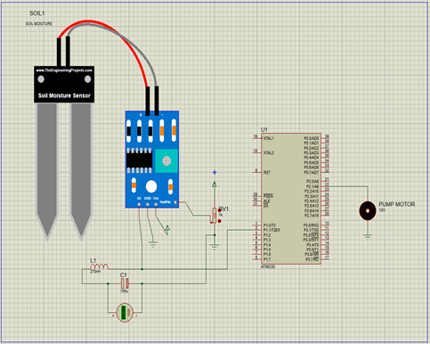
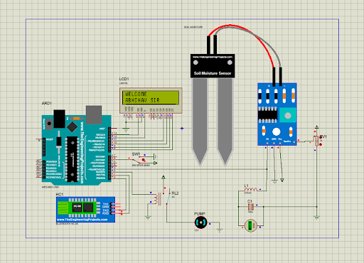

Automatic Plant watering system will serve the following purposes:
1) As there is no unplanned use of water, lot of water is saved from being wasted.
2) The plants are watered automatically only when there is not enough moisture in the soil. Thus, the users can do their work without having to take out time for watering their plants.

System Using Microcontroller:

System Using Arduino:

Presentation: https://github.com/aryanjain27april/Automatic_Plant_Watering_System/blob/main/Presentation/Plant%20Watering%20System.pdf